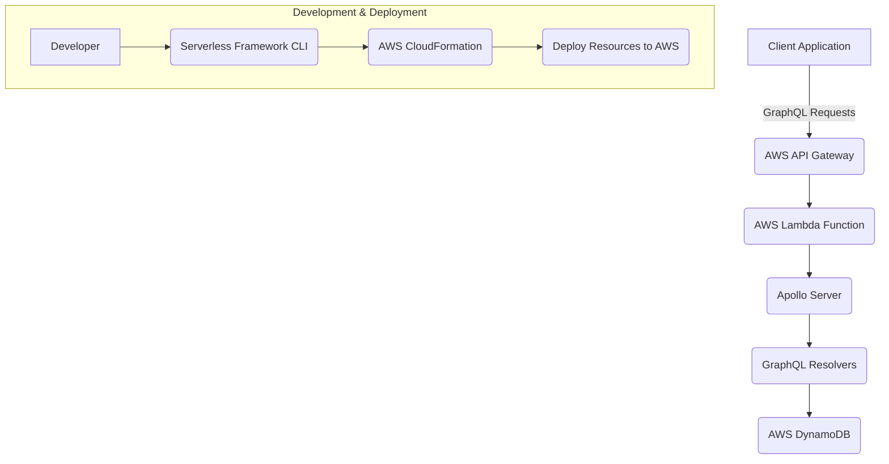

Here's an improved `README.md` for a serverless GraphQL project, designed to be informative, engaging, and easy to navigate.

---

# NebulaGraph: Scalable Serverless GraphQL API Template

[](https://github.com/your-org/your-repo/actions)
[](LICENSE)
[](https://github.com/your-org/your-repo/stargazers)
[](https://www.serverless.com/)
[](https://graphql.org/)
[](https://nodejs.org/)

## 🚀 Overview

NebulaGraph is a highly scalable and cost-effective serverless GraphQL API template built on AWS. It leverages the power of AWS Lambda, API Gateway, and DynamoDB (or a database of your choice) to provide a robust backend for your web, mobile, or IoT applications. This project is designed for rapid development, offering a solid foundation for building feature-rich GraphQL services without managing any servers.

### ✨ Why Serverless GraphQL?

*   **Auto-scaling:** Handle traffic spikes seamlessly without manual intervention.
*   **Cost-Effective:** Pay only for the compute time you consume.
*   **Rapid Development:** Focus on your business logic, not infrastructure.
*   **Performance:** Low latency and high availability out-of-the-box with AWS.
*   **GraphQL Benefits:** Strong typing, efficient data fetching, and a single endpoint for all your data needs.

## 🌟 Features

*   **Serverless Architecture:** Deployed on AWS Lambda and API Gateway using the Serverless Framework.
*   **GraphQL API:** Powered by Apollo Server, supporting queries, mutations, and subscriptions (optional setup).
*   **DynamoDB Integration:** Example data models and resolvers for DynamoDB (easily swappable with other databases).
*   **Schema-First Development:** Define your API contract clearly with GraphQL SDL.
*   **Local Development:** Full local API emulation with `serverless-offline` and GraphQL Playground.
*   **Authentication & Authorization:** Placeholder for JWT (e.g., Cognito, Auth0) or API Key integration.
*   **Environment Configuration:** Easy management of environment variables using `dotenv`.
*   **Automated Deployment:** Seamless deployment to AWS via Serverless Framework CLI.
*   **TypeScript Support:** (Optional, but highly recommended) Enhances developer experience with strong typing.
*   **Monitoring & Logging:** Integrated with AWS CloudWatch for operational visibility.

## 🏗️ Architecture

The project's architecture is straightforward:

1.  **Client Application:** Makes GraphQL requests to the API Gateway.
2.  **AWS API Gateway:** Acts as the entry point, routing GraphQL requests to the Lambda function.
3.  **AWS Lambda:** Executes the GraphQL server (Apollo Server) code. This function handles the request, processes it, and invokes resolvers.
4.  **Apollo Server:** Parses GraphQL queries, validates them against the schema, and executes the corresponding resolvers.
5.  **AWS DynamoDB:** Serves as the primary data store (can be replaced with RDS, Aurora Serverless, etc.). Resolvers interact with DynamoDB to fetch or modify data.
6.  **Serverless Framework:** Manages the deployment and configuration of all AWS resources.



## 🚀 Getting Started

Follow these steps to get your serverless GraphQL API up and running locally and deployed to AWS.

### Prerequisites

Before you begin, ensure you have the following installed:

*   **Node.js**: `v18.x` or higher
*   **npm** or **Yarn**: For package management
*   **AWS CLI**: Configured with credentials for your AWS account.
    *   [Install AWS CLI](https://docs.aws.amazon.com/cli/latest/userguide/install-cliv2.html)
    *   [Configure AWS CLI](https://docs.aws.amazon.com/cli/latest/userguide/cli-configure-quickstart.html)
*   **Serverless Framework CLI**:
    ```bash
    npm install -g serverless
    # OR
    yarn global add serverless
    ```

### Installation

1.  **Clone the repository:**
    ```bash
    git clone https://github.com/your-org/your-repo.git
    cd your-repo
    ```
2.  **Install dependencies:**
    ```bash
    npm install
    # OR
    yarn install
    ```
3.  **Configure environment variables:**
    Create a `.env` file in the root directory by copying the example:
    ```bash
    cp .env.example .env
    ```
    Edit `.env` and fill in any necessary values (e.g., `AWS_REGION`, `DYNAMODB_TABLE_NAME`). For local development, some values might be optional or have default local settings.

## 💻 Local Development

Run your GraphQL API locally using `serverless-offline`. This simulates the AWS Lambda and API Gateway environment on your machine.

1.  **Start the local server:**
    ```bash
    sls offline start
    # OR
    npm run start:local
    ```
2.  **Access GraphQL Playground:**
    Open your browser and navigate to `http://localhost:3000/graphql`.
    You can now interact with your GraphQL API using the Playground.
    If you're using DynamoDB Local, ensure it's running in a separate terminal or configured to run automatically.

## 🚀 Deployment

Deploy your GraphQL API to AWS with a single command.

1.  **Deploy to AWS:**
    ```bash
    sls deploy --stage dev
    # OR for production:
    sls deploy --stage prod
    ```
    The `serverless.yml` file defines your service, functions, and resources. You can create different stages (e.g., `dev`, `staging`, `prod`) to manage separate deployments.

2.  **Retrieve API Endpoint:**
    After successful deployment, the Serverless Framework will output the service information, including your GraphQL API endpoint. It will look something like this:

    ```
    Service Information
    service: nebulagraph-api
    stage: dev
    region: us-east-1
    stack: nebulagraph-api-dev
    resources: 10
    api keys:
      None
    endpoints:
      ANY - https://<your-api-id>.execute-api.<your-aws-region>.amazonaws.com/dev/graphql
    functions:
      graphql: nebulagraph-api-dev-graphql
    ```
    Your API endpoint will be `https://<your-api-id>.execute-api.<your-aws-region>.amazonaws.com/<stage>/graphql`.

## 💡 Usage Examples

Here are some example GraphQL queries and mutations you can try using your deployed API endpoint or the local GraphQL Playground.

**GraphQL Endpoint:** `YOUR_API_ENDPOINT` (e.g., `https://xxxxxx.execute-api.us-east-1.amazonaws.com/dev/graphql`)

### Query: Fetch all Items

```graphql
query GetAllItems {
  items {
    id
    name
    description
    createdAt
  }
}
```

### Mutation: Create an Item

```graphql
mutation CreateNewItem {
  createItem(input: { name: "New Serverless Item", description: "This item was created via GraphQL." }) {
    id
    name
    createdAt
  }
}
```

### Mutation: Update an Item

```graphql
mutation UpdateExistingItem {
  updateItem(id: "YOUR_ITEM_ID", input: { name: "Updated Serverless Item", description: "The description has been updated." }) {
    id
    name
    description
  }
}
```

### Mutation: Delete an Item

```graphql
mutation DeleteAnItem {
  deleteItem(id: "YOUR_ITEM_ID") {
    id
    message
  }
}
```

## 📚 API Documentation

The GraphQL API is self-documenting! You can explore the full schema and available operations using:

1.  **GraphQL Playground / GraphiQL:** Access it at your API endpoint (e.g., `YOUR_API_ENDPOINT` or `http://localhost:3000/graphql`). The Docs tab provides detailed information.
2.  **Introspection:** Any GraphQL client can use introspection to fetch the schema directly.

### Schema Definition Language (SDL) Overview

Here's a simplified look at the core types defined in `src/graphql/schema.graphql`:

```graphql
# src/graphql/schema.graphql

type Item {
  id: ID!
  name: String!
  description: String
  createdAt: String!
  updatedAt: String!
}

input CreateItemInput {
  name: String!
  description: String
}

input UpdateItemInput {
  name: String
  description: String
}

type DeleteResult {
  id: ID!
  message: String!
}

type Query {
  getItem(id: ID!): Item
  items: [Item!]!
}

type Mutation {
  createItem(input: CreateItemInput!): Item!
  updateItem(id: ID!, input: UpdateItemInput!): Item!
  deleteItem(id: ID!): DeleteResult!
}

# type Subscription {
#   itemAdded: Item
# }
```

### Authentication & Authorization

This template includes a placeholder for authentication. You can integrate:

*   **AWS Cognito User Pools:** Use a custom authorizer Lambda function.
*   **JWT Verification:** Verify tokens from Auth0, Firebase, or your own identity provider.
*   **API Keys:** Secure your endpoint with API keys via API Gateway.

Refer to the `serverless.yml` and `src/graphql/context.ts` (or similar file) for where to integrate your chosen authentication logic.

## 🤝 Contributing

We welcome contributions to make NebulaGraph even better! Please follow these guidelines:

1.  **Fork the repository:** Start by forking the project to your GitHub account.
2.  **Clone your fork:**
    ```bash
    git clone https://github.com/YOUR_USERNAME/nebulagraph.git
    cd nebulagraph
    ```
3.  **Create a new branch:**
    ```bash
    git checkout -b feature/your-feature-name
    # OR
    git checkout -b bugfix/your-bug-fix
    ```
4.  **Make your changes:**
    *   Implement your feature or fix.
    *   Ensure all tests pass (`npm test`).
    *   Add new tests for your changes where appropriate.
    *   Follow the existing code style.
5.  **Commit your changes:**
    ```bash
    git commit -m "feat: Add new feature for X"
    # OR
    git commit -m "fix: Resolve bug in Y"
    ```
    (Please use [Conventional Commits](https://www.conventionalcommits.org/en/v1.0.0/) if possible).
6.  **Push to your branch:**
    ```bash
    git push origin feature/your-feature-name
    ```
7.  **Open a Pull Request (PR):**
    *   Go to the original repository on GitHub.
    *   Click on the "New Pull Request" button.
    *   Provide a clear title and description for your changes.
    *   Link to any relevant issues.

### Code Style & Linting

This project uses ESLint and Prettier for code consistency. Please ensure your code adheres to the style guidelines.
*   Run linting: `npm run lint`
*   Fix linting errors: `npm run lint:fix`

### Testing

Run tests locally using Jest:
```bash
npm test
```

### Code of Conduct

Please note that this project is released with a [Contributor Code of Conduct](CODE_OF_CONDUCT.md). By participating in this project, you agree to abide by its terms.

## 📄 License

This project is licensed under the MIT License - see the [LICENSE](LICENSE) file for details.

---

Crafted with ❤️ for the serverless community.